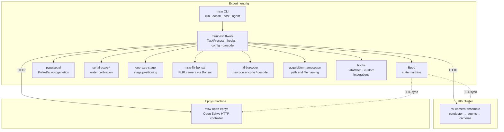

# Architecture Overview

## System components

The diagram shows how the MSW packages connect across the three physical contexts
(experiment rig, RPi camera cluster, ephys machine). Solid arrows are software
calls; dashed arrows are hardware TTL sync pulses.



All hardware drivers (`pypulsepal`, `serial-scale-*`, `one-axis-stage`, `msw-flir-bonsai`,
`rpi-camera-ensemble`, `msw-open-ephys`) are optional extras. A minimal rig install only
needs the base `murineshiftwork` package with `acquisition-namespace` and `ttl-barcoder`.

The TTL barcode is output as a digital pulse train by the Bpod state machine. The same
signal is recorded on a dedicated channel by Open Ephys and by each RPi camera's GPIO
TTL input, enabling offline sample-accurate alignment across all three systems.

---

## Internal layers

```
CLI (msw run / msw action / ...)
  │
  ├── evaluate_args()       : validates + resolves all config, builds ExecutionConfig
  │
  ├── run_task()            : imports task module, delegates to TaskProcess
  │
  └── TaskProcess           : session lifecycle: paths, Bpod, hooks, TaskRunner thread
          │
          ├── pre-hooks     : run before task init; may mutate task_settings
          ├── TaskRunner    : task-specific thread (run loop + state machine)
          └── post-hooks    : run after task thread; may read output
```

## Key modules

| Module | Purpose |
|---|---|
| `murineshiftwork.cli.evaluate` | Settings priority chain, config loading |
| `murineshiftwork.logic.task_process` | Session orchestration |
| `murineshiftwork.logic.hooks` | Pre/post hook system |
| `murineshiftwork.logic.config` | Config models, IO, deep_merge |
| `murineshiftwork.hardware.bpod` | Bpod connection and action drivers |
| `murineshiftwork.tasks.*` | Task-specific protocol implementations |
